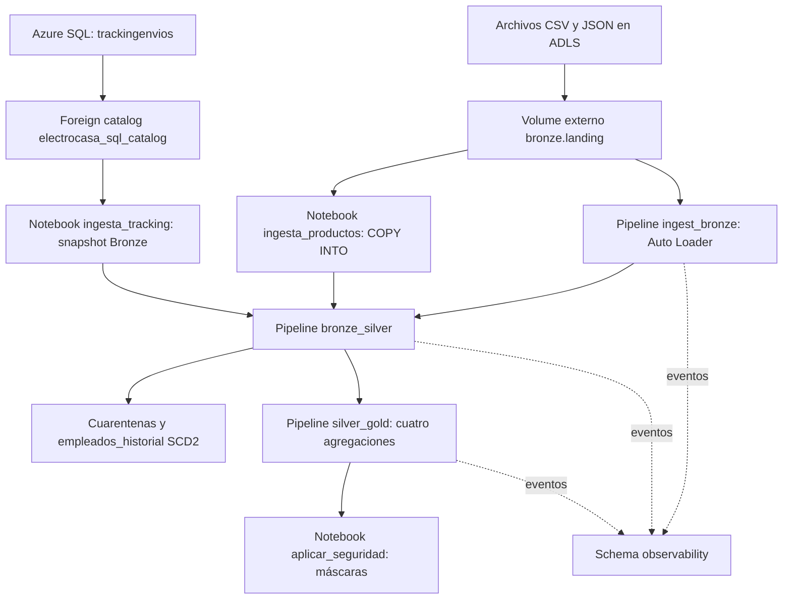

# ElectroCasa Lakehouse

Implementación de una arquitectura Bronze → Silver → Gold en Azure Databricks para integrar ventas, productos, empleados, reseñas, devoluciones y tracking de envíos. El repositorio contiene tres pipelines declarativos, un job de seis tareas y transformaciones PySpark reutilizables.

Este documento describe el código disponible. Los conteos de datos, las ejecuciones exitosas y los permisos efectivos deben verificarse en el workspace; no se presentan cifras de una ejecución ajena como resultados del proyecto.

## Arquitectura



El bundle despliega los recursos en `dev` o `prod`. Unity Catalog organiza los datos en los schemas `bronze`, `silver`, `gold` y `observability`.

| Decisión | Aplicación en este repositorio |
|---|---|
| Separar tres pipelines | Permite identificar fallos de ingesta, transformación o agregación y establecer dependencias explícitas. |
| Volume externo | Expone archivos de ADLS mediante `/Volumes/<catalogo>/bronze/landing`. Las tablas se crean sin una ubicación externa explícita. |
| Auto Loader | Ingiere las cuatro fuentes incrementales con esquemas definidos en código y `schemaLocation` por fuente. |
| COPY INTO | Incorpora los archivos JSON de productos mediante un notebook batch. |
| Federation y materialización | Lee Azure SQL a través de una conexión de Unity Catalog y reemplaza el snapshot de tracking en Bronze. |
| Serverless | Los tres pipelines declaran `serverless: true` y Photon. El job no define clusters clásicos para sus notebooks. |
| Código compartido | `sync.paths` incluye `../src`; la raíz de los pipelines apunta a `${workspace.root_path}/files` para resolver los imports. |

## Fuentes y trazabilidad

| Fuente | Entrada | Destino Bronze | Método |
|---|---|---|---|
| Ventas | CSV | `ventas` | Auto Loader |
| Empleados | CSV | `empleados` | Auto Loader |
| Reseñas | JSON | `resenas` | Auto Loader |
| Devoluciones | CSV | `devoluciones` | Auto Loader |
| Productos | JSON | `productos` | COPY INTO |
| Tracking | `electrocasa_sql_catalog.dbo.trackingenvios` | `tracking_envios` | Consulta federada y `CREATE OR REPLACE TABLE` |

Las ingestas añaden `fec_ingesta`, `sistema_origen`, `archivo_origen` e `id_lote`. En tracking, `archivo_origen` es nulo porque el origen es SQL. La conexión usa el scope `electrocasa-secrets`, claves `user` y `password`; el código no acredita que el scope esté respaldado por Key Vault.

## Silver: calidad y cambios históricos

Las transformaciones tipan columnas, normalizan valores y aplican reglas específicas por dominio.

| Tabla | Regla o transformación | Tratamiento |
|---|---|---|
| `ventas` | `monto_total > 0`; normalización de métodos de pago y fechas | Expectation con descarte y tabla `ventas_cuarentena`. |
| `resenas` | Calificación entre 1 y 5; normalización de arrays y respuestas | Expectation con descarte y `resenas_cuarentena`. |
| `devoluciones` | Reembolso mayor o igual a cero | Expectation con descarte y `devoluciones_cuarentena`. |
| `productos` | Precio numérico, categoría normalizada y marca faltante | Conserva snapshots; no elige una versión más reciente sin secuencia temporal. |
| `tracking_envios` | Normalización de courier y estado | Deduplica por los campos de negocio definidos en la transformación. |
| `empleados_eventos` | Fecha presente y un solo evento por empleado/fecha | Los eventos sin secuencia confiable van a `empleados_cuarentena`. |

Reseñas y devoluciones marcan `producto_huerfano`; esta marca no implica descarte. Las cuarentenas añaden `motivo_rechazo` y `fec_rechazo`.

La deduplicación no es uniforme: ventas y devoluciones usan conjuntos de campos de negocio, mientras reseñas usa `dropDuplicates()` sobre todas sus columnas. No se garantiza unicidad por identificador en todos los dominios.

### Historial de empleados

`empleados_historial` usa AUTO CDC con clave `id_empleado`, secuencia `fecha_evento` y SCD tipo 2. Un evento `tipo_evento = 'baja'` se aplica como eliminación; una versión vigente tiene `__END_AT IS NULL`. Las consultas V06–V08 comprueban unicidad vigente, coherencia de intervalos y conciliación de dotación.

## Gold y validaciones

| Tabla | Grano y medidas | Comprobación propuesta |
|---|---|---|
| `ventas_sucursal_mes` | Sucursal/mes: ventas distintas, monto y ticket promedio | Revisar su definición en `src/electrocasa/transforms/gold/ventas_sucursal_mes.py`. |
| `productos_ventas_devoluciones` | Producto: unidades, ventas, devoluciones, reembolsos y rankings | V04 detecta atributos ambiguos; V05 compara reembolsos por producto. |
| `dotacion_sucursal` | Sucursal: empleados distintos con versión vigente | V08 devuelve únicamente discrepancias por sucursal. |
| `resenas_categoria` | Categoría: reseñas distintas, negativas y porcentaje | V09 identifica tasas o numeradores inconsistentes. |

Las agregaciones de productos se calculan antes del join, pero si un `producto_id` tiene varios nombres o categorías, `distinct()` no garantiza una única fila de referencia. Por eso se incluye una validación específica de esa condición. No se afirma ausencia de multiplicación sin comprobar los datos.

## Orquestación y ambientes

El job [job_electrocasa_wkf_end_to_end](electrocasa/resources/job_electrocasa_wkf_end_to_end.yml) ejecuta:

```text
ingesta_productos ─┐
ingesta_tracking  ─┼─> bronze_silver ─> silver_gold ─> aplicar_seguridad
ingest_bronze     ─┘
```

Las primeras tres tareas pueden ejecutarse en paralelo. El job permite una ejecución concurrente. Solo `aplicar_seguridad` declara un reintento con intervalo mínimo de 60 segundos. No hay schedule ni notificaciones por correo configurados en el YAML actual.

| Target | Catálogo | Landing | Modo del pipeline |
|---|---|---|---|
| `dev` | `electrocasa` | `/Volumes/electrocasa/bronze/landing` | Desarrollo |
| `prod` | `electrocasa_prod` | `/Volumes/electrocasa_prod/bronze/landing` | Producción |

Ambos targets apuntan al mismo workspace, con raíces de despliegue separadas por target. La conexión y el foreign catalog de Azure SQL tienen nombres compartidos entre ambientes.

## Preparación y ejecución

1. Crear o verificar los grupos de cuenta `electrocasa_engineers`, `electrocasa_analysts` y `electrocasa_auditors`; asignar los grupos necesarios al workspace.
2. Preparar el acceso a ADLS y la ubicación externa requerida para crear el Volume. Configurar `electrocasa-secrets` con `user` y `password` y el acceso a Azure SQL.
3. Ejecutar [00_setup.ipynb](notebooks/00_setup.ipynb) con el catálogo y ubicación de landing del ambiente. Este notebook crea catálogo, schemas, Volume, directorios, conexión y foreign catalog; concede permisos, pero no crea grupos ni el secret scope.
4. Para producción, revisar también `container` y `landing_subpath`: cambiar el catálogo por sí solo no cambia la ubicación física de ADLS. Usar una ubicación externa compatible y separada cuando se requiera aislamiento.
5. Cargar los archivos de las cinco fuentes en sus carpetas de landing.
6. Desde la raíz del repositorio:

```bash
cd electrocasa
databricks bundle validate -t dev &&
databricks bundle deploy -t dev &&
databricks bundle run -t dev job_electrocasa_wkf_end_to_end
```

Para producción, repetir con `-t prod` después de preparar sus datos y permisos. El notebook de setup no forma parte del job ni se sincroniza con los paths actuales; se ejecuta por separado.

## Gobierno y seguridad

El setup concede los siguientes permisos por schema:

| Grupo | Concesiones declaradas |
|---|---|
| Engineers | Uso, SELECT, MODIFY, CREATE TABLE y CREATE FUNCTION en las cuatro capas/schemas. |
| Analysts | Uso y SELECT en Gold. |
| Auditors | Uso y SELECT en Gold y observability. |

**Los REVOKE de Bronze y Silver están comentados en el setup actual.** No se puede afirmar que se hayan retirado accesos previos; revisar concesiones directas, heredadas y pertenencia a grupos con V12.

`permissions.yml` concede CAN_MANAGE del job y pipelines a Engineers en ambos targets; en producción, Auditors recibe CAN_VIEW del job.

La tarea `aplicar_seguridad` crea y aplica máscaras a `dni` y `salario` de `silver.empleados_historial`. Engineers conserva los valores; los demás usuarios reciben `********` y `NULL`, respectivamente, siempre que tengan acceso de lectura. Las máscaras no conceden acceso a la tabla ni protegen automáticamente otras tablas que contengan esos campos. Como esta tarea corre al final, comprobar que terminó correctamente antes de considerar aplicada la protección.

## Consultas listas para ejecutar

Abrir [sql/validaciones.sql](sql/validaciones.sql), ejecutar `USE CATALOG electrocasa` y después cada bloque por separado en el editor SQL. Para producción usar `USE CATALOG electrocasa_prod`. En un notebook, usar celdas SQL o anteponer `%sql` a cada bloque.

| Consulta | Qué verifica | Cómo interpretar |
|---|---|---|
| V01 | Inventario visible | Revisar tablas de las cuatro capas/schemas. |
| V02 | Reglas críticas de Silver | Cero infracciones y tablas con datos. |
| V03 | Cuarentenas por causa | Revisar causas; `sin_trazabilidad` debe ser cero. |
| V04 | Atributos ambiguos por producto | Sin filas; cualquier fila requiere revisión del join Gold. |
| V05 | Reembolso Silver/Gold por producto | Sin discrepancias; tolerancia de 0.01. |
| V06 | Versiones vigentes SCD2 | Sin claves nulas ni varias versiones vigentes. |
| V07 | Intervalos SCD2 | Sin intervalos invertidos o superpuestos. |
| V08 | Dotación por sucursal | Sin diferencias ni sucursales faltantes. |
| V09 | Tasa de reseñas negativas | Sin inconsistencias internas. |
| V10–V11 | Funciones y aplicación de máscaras | Comparar según pertenencia a Engineering y revisar metadatos. |
| V12 | Permisos | Evaluar concesiones, no asumir restricciones por ausencia de un GRANT local. |
| V13 | Errores/advertencias de los tres pipelines | Revisar antigüedad y ejecución asociada; pueden ser fallos ya reparados. |

Las consultas no modifican los datos. Se deben ejecutar con permisos suficientes, después de una carga completa y sin cargas concurrentes. Un resultado vacío en una comprobación de discrepancias no prueba que existan datos: contrastarlo con el inventario y los conteos. Las consultas se revisaron contra el código; sus resultados quedan pendientes de ejecución en Databricks.

## Monitoreo y evidencias

Cada pipeline publica un event log en `observability`. El archivo `electrocasa/resources/notebooks/monitoring/event_log.py` contiene una consulta resumida del pipeline Silver, pero no es una tarea del job. El repositorio no incluye una definición de dashboard desplegable.

Para documentar una ejecución propia, registrar target, catálogo, fecha, identificador de ejecución y resultado de las consultas. Capturas sugeridas, diferentes de los ejemplos de referencia:

- Detalle de V03 con causas de rechazo por fuente.
- V05 mostrando productos con discrepancias o un resultado sin diferencias.
- V08 con conciliación de dotación por sucursal.
- V10 con valores ficticios de prueba y pertenencia al grupo.
- DAG real con sus seis tareas y estado final.

Las capturas de referencia muestran otro nombre de job y otra estructura de tareas; no acreditan una ejecución de este bundle. No se incorporan enlaces a imágenes inexistentes ni cifras tomadas de ellas.

## Estructura del repositorio

```text
electrocasa-lakehouse/
├── README.md
├── sql/validaciones.sql
├── notebooks/00_setup.ipynb
├── electrocasa/
│   ├── databricks.yml
│   ├── variables.yml
│   ├── permissions.yml
│   └── resources/
│       ├── job_electrocasa_wkf_end_to_end.yml
│       ├── pipelines/                 # Bronze, Silver y Gold
│       └── notebooks/
│           ├── ingestion/
│           ├── pipelines/             # Definiciones declarativas
│           ├── governance/
│           └── monitoring/
└── src/
    ├── common/utils.py
    └── electrocasa/
        ├── schemas/
        ├── expectations/silver/
        └── transforms/                # Silver y Gold
```

## Incidencias resueltas en la configuración

- Grupo no encontrado: los permisos requieren que el grupo exista y sea reconocido por el workspace; ejecutar el setup no crea identidades.
- Job sin tareas: la definición del recurso incluye ahora sus tareas, además de sus permisos.
- `No module named 'src'`: sincronización del código compartido y raíz de imports alineadas con `files/`.
- Imports de esquemas: apuntan a `src.electrocasa.schemas`, sin una subcarpeta `bronze` inexistente.
- Notebook de seguridad no encontrado: ruta relativa a `resources/` y cabecera `# Databricks notebook source` corregidas.
